# [Crux - Training for climbers](https://cjepps-crux.herokuapp.com/)
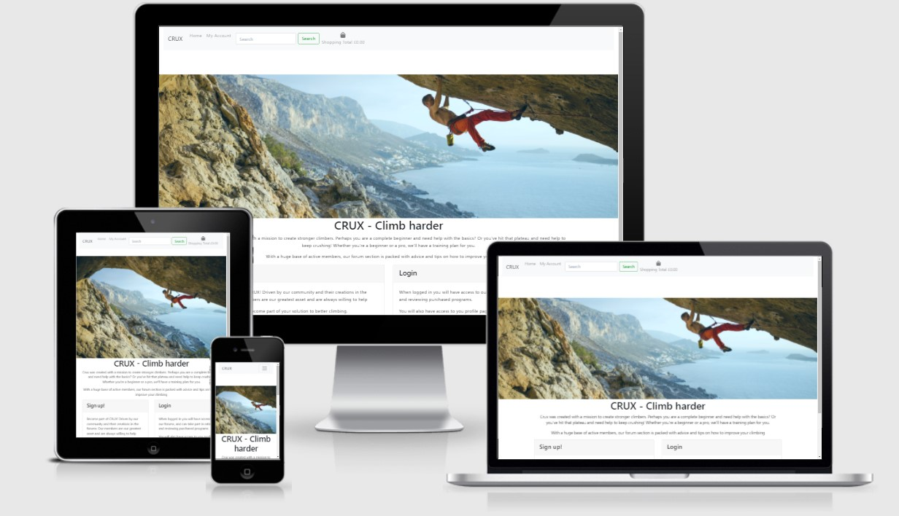


 In this project I will create a full-stack ecommerce website to sell climbing training programs for a climbing club.
 The website will feature: a shop in which to buy and access pre-made training programs, a blog in which registered users can view posts made by the website staff, and a profile in which to view purchased plans.   

## UX
---

### Project Goals


### User Stories

As a general user, I want:
- To be able to view the site on my preferred device (mobile, tablet, desktop)
- To be given an easy way to navigate to the content I want to view.
- To be able to be given information that describes the intention of the website.
- To be able to sign up as a registered user.
- To be able to view climbing programs to purchase.


As a registered user, I want:
- To have access to blogs, where I can view admin submitted blog posts.
- To have access to my profile page so that I can view my purchased plans.
- To be able to log in/logout of my account using registered details.
- To view and edit my shopping cart when making purchases.
- To be able to securely pay for products.
- To be able to view reviews on products, helping to inform my purchase.  


As a website owner, I want:
- The ability to edit the content displayed on the website.


### Design Choices


#### Colour scheme
- I used a very simple color scheme with mostly white backgrounds. This decision was made in order to contrast to the main hero image and draw the eye to the products themselves. Main CTAs and links are brightly colored to aid navigation throughout the site.
 
 
#### Imagery
- the main imagery of the site consists of the main hero image on the index page. I chose a large exciting image in order to inspire potential customers. Product mockups were also generated using royalty free images from Google that corresponded to the products being advertised. Icons from font awesome were also employed to help users better understand buttons in the site and what they might do.

   
### Wireframes
You can view the wireframes used for this project [here](https://github.com/CJepps/Crux/tree/main/static/img/readme/wireframes)

# Information Architecture

## Database

- SQLite used during development to store data, this was installed with Django. 
- PostgreSQL has been used in production. 
- User model provided by [Django Allauth](https://django-allauth.readthedocs.io/en/latest/overview.html).

## Data Model

The following diagram shows the relationships between models. 

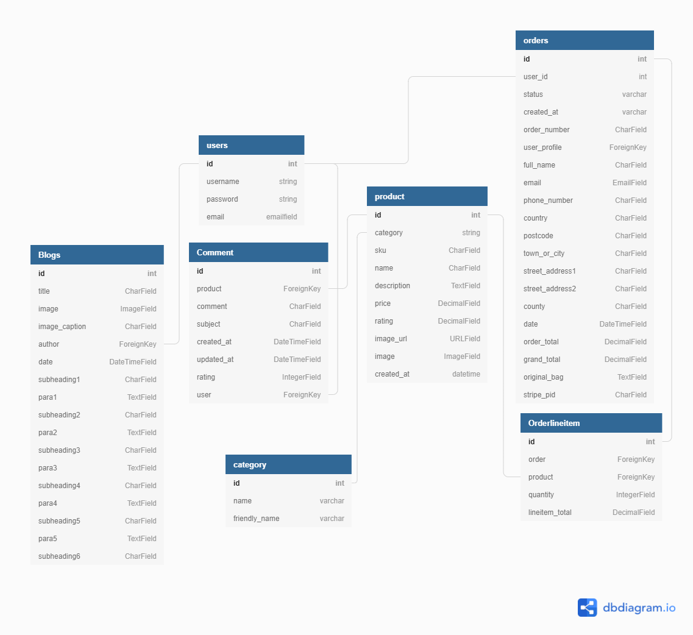

### Blog App
- Blog Model
    - Contains details of the blog post and is linked to the User model by the 'author' field. 

### Checkout App
- Order Model
    - Contains details of the user's orders, delivery details, and the plans that they've purchased. It is linked to the UserProfile Model by the 'user_profile' field

- OrderLineItem Model
    - Contains data for the customer order, and product total. It is linked to the Order Model by the 'order' field and the Product Model by the 'product field'.
### Products App

- Category
    - Contains Product Categories options for products. It is linked to the Product Model using a foreign key.

- Product
    - Contains detailed product data for each product. 

- Comment
    - Contains review information for each product. It is linked to the Products Model by the 'product' field and the Users Model by the 'user' field.  
 
### Profiles App
- UserProfile
    - Contains the user's order details, so they can view their purchased plans. 
 
### Django Allauth
- User
    - The User model is provided by default from Django Allauth and contains the username, password, and email for each user. 


## Features
---
### Existing Features

#### Base Template


- Navbar Desktop - the navbar is fully expanded on large resolutions to make maximum use of the screen. There are links to login/ signup for non-registered users. Registered users will be provided with products, blogs, and my account which contains links to the user's profile and an option to logout. A search bar is also provided here to allow users to quickly find areas of the site by searching with keywords. On adding items to the shopping bag, a running total is also displayed with the option to checkout.   

- Navbar Mobile - All smaller screens the navbar collapses into a hamburger icon. When clicked on, this expands into a dropdown menu containing all the navigation links from above. This is a standard design choice for most websites in order to give mobile use maximum screen space for other vital components of the website.  


- Toast Messages - Toast messages were employed to give the user feedback on actions they were taking in the site. These were colour coded to aid comprehension.
    - Green: Success
    - Yellow: Warning
    - Blue: Informative
    - Red: Errors

#### Home page

The home page has been kept relatively simple. A large hero image reinforces to the user that this website is about rock climbing. There is a small about section that informs users about the purpose of the website. Directly below this are two cards that contain Calls to action. These links will change depending on whether the user is registered or not. Non-registered = login/sign up. Registered  = Blogs/Products.  
 

#### Products Page
- features a searchbar that allows users to locate their plan through keywords or by category of product 
- Gallery of cards displays products, showing product image, and basic information about the product such as price and rating 
- each card is a link to the detail page of the product
- Gallery is responsive so that on smaller screen sizes there are fewer product cards in each row. 

 

#### Product Detail Page
- features a large image of the training plan alongside a description on details of the plan.
- a quantity selector is also provided to select the required quantity of product before ordering. This may seem strange as you would only buy 1 plan usually. I've included this so that there is the possibility of the site selling physical goods.
- Review section containing a list of previous reviews and a form in which to submit your own review of the product. This can only be done by registered users 
- keep shopping button returns users back to the main products page
- Add to bag button saves the product with whatever quantity was selected to the shopping bag   


#### Shopping Bag Page
    - Product image displays an image of the product the user has added to their bag. 
    - Product info section displays the name of the product, product sku, and product price  
    - Quantity button - Users can update their order using the quantity selectors and the update button. Users can remove their plan from their shopping bag  by clicking the remove button. 
    
- Underneath the products that are in the user's bag, users are provided information for bag total, delivery and grand total. 
- users are provided a button to take the users back to the all product page, and a Secure Checkout button to take the user to the checkout page. 
 

 

#### Checkout Page
- features a form in which users can submit their address details
- features an order summary, listing the products in their order 
- features a secure payment form 


#### Checkout Success Page 
- features a success message that confirms a user's order number
- Features an order summary confirming what was ordered and the delivery address requested 
- a confirmation email is sent, confirming all the order details that were entered in the checkout page 
  

#### Blog Page
- Similar to the products page, this displays a list of all blogs currently on the site. If a blog image or title is selected, the user is directed to the blog detail page


#### Blog Detail Page
- the blog detail page provides a template from which information submitted by an admin can be rendered. 
 

#### Profile Page 
- the profile page provides a list of all purchased plans for the user in question. This allows users to quickly find details about their plan 
 

### Allauth features
- The sign up, register, password reset, email confirmation pages etc, have all been provided by Django allauth and customised to suit the needs of the site where required.

### Admin Features

- Admin will have access to additional features across the site. Within the link to 'my account' on the main navigation bar, superusers are given a product management page. Superusers are also given the option to delete/edit products from the view of all products, buttons are provided on each individual product card to do this   

 

## Technologies Used
## Languages
---
1. HTML5
2. CSS3 
3. JavaScript
4. Python 3.6.8

## Additional Frameworks, Libraries, and Programs used
---
3. Bootstrap 4.4.1
* Used the grid system to aid with the responsiveness of the website
4. Font awesome
* Used to provide icons for the website
5. Git
* used for version control
6. GitHub
* used to store pushed code in a repository
7. Balsamiq
* Used to create wireframes at the start of the project
8. jQuery 
* included with bootstrap
10. [amiresponsive](http://ami.responsivedesign.is/)
* used to create mockups of the website at different resolutions (for the first image of readme)
11. LambdaTest
* used to test responsiveness on a range of browsers 
12. MongoDB Atlas
* used as a non-relational database to store backend data
13. [Django](https://www.djangoproject.com/)
* This was the primary framework used for the project
14. [Django Crispy Forms](https://django-crispy-forms.readthedocs.io/en/latest/)
* This has been used to render the forms on the site.
15. [Django Allauth](https://django-allauth.readthedocs.io/en/latest/index.html)
* This has been used for user authentication on the site.
16. [Django Countries](https://pypi.org/project/django-countries/)
* Used to populate the countries select field on the order form and profile form
17. [Stripe](https://stripe.com/gb)
* used to handle payments.
18. [Amazon Web Services](https://aws.amazon.com/)
* Used to store all static files and images
19. [SQLite](https://www.sqlite.org/index.html)
* Database used in development
20. [PostgreSQL](https://www.postgresql.org/)
* Database used in production
21. [Heroku](https://id.heroku.com/login)
* Online  Platform used to deploy the live site
22. [Gunicorn](https://gunicorn.org/)
*  for deploying the project to Heroku    
23. [Dbdiagram](https://dbdiagram.io/home) 
*  Used to create the database schema illustration.


---


## Testing
---

### Validator Testing
**HTML**
- [W3C HTML Validator](https://validator.w3.org) - No errors. "Document checking completed. No errors or warnings to show".
 


**CSS**
- [W3C CSS Validator](https://jigsaw.w3.org/css-validator/) -No errors. Validator results can be viewed [here](http://jigsaw.w3.org/css-validator/validator?lang=en&profile=css3svg&uri=https%3A%2F%2F8000-purple-slug-7wvt7202.ws-eu38.gitpod.io%2F&usermedium=all&vextwarning=&warning=1)

**JavaScript**
- [Esprima](https://esprima.org/demo/validate.html) - No Errors. Code is syntactically valid. 
---


### Testing user stories from UX section
I manually tested the website with debugger.
```python
debug=True
```
Whenever the app crashed I was able to resolve issues by going back to the routes and templates and examining the relevant code by looking at the trace backs in the debugger.

### As a general user, I want:
---
#### To be able to view the site on my preferred device (mobile, tablet, desktop)
- Through the use of bootstrap and css media queries, the site is responsive across a range of different resolutions. The website was also tested on a range of browsers using lambdatest. Devtools was also utilized during development to test responsiveness at different breakpoints  
#### To be given an easy way to navigate to the content I want to view.
- Users are given a straightforward and easy to understand navigation bar. This persists throughout the site and is posistioned to always be in view
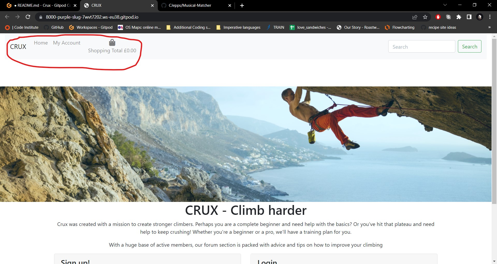
- public, non-registered users are given navigation links to sign up or register and do not see links to the remainder of the site 
- on devices with smaller screens, the navbar collapses into a hamburger icon..
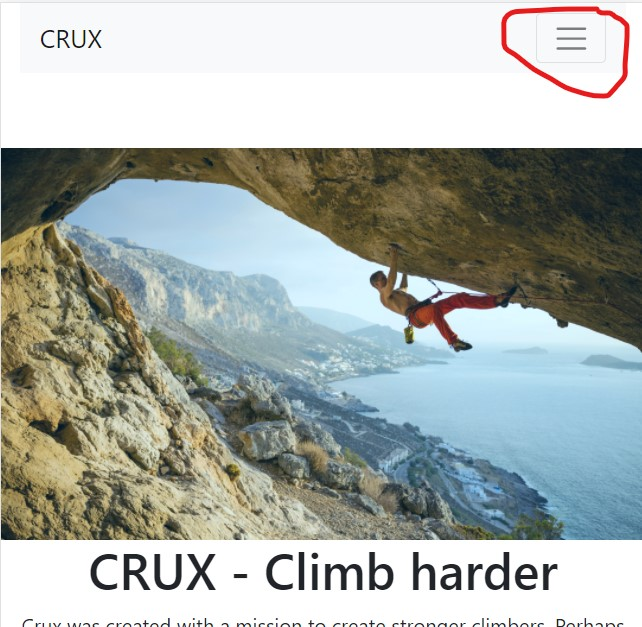

#### To be able to be given information that describes the intention of the website.
- The index page features an about section underneath the main hero image which describes the purpose of the website.
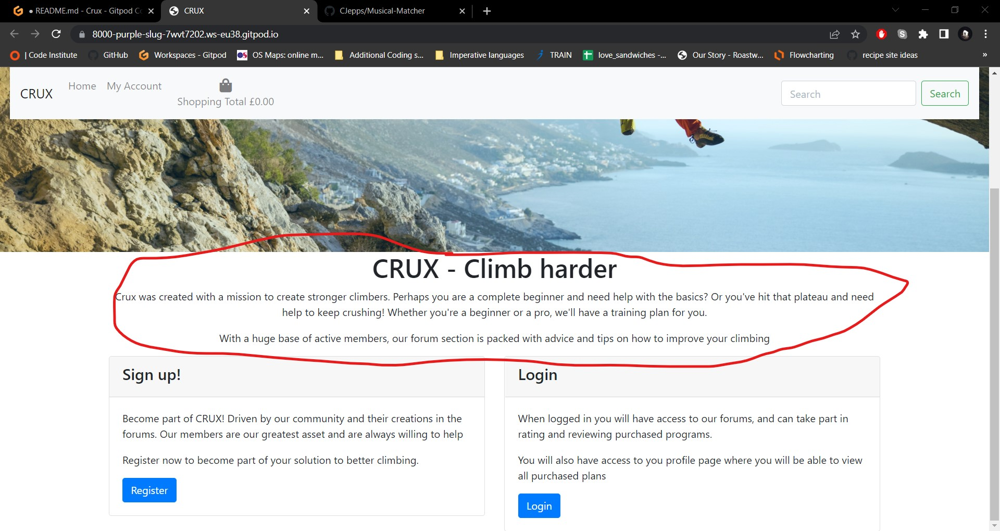
- The index page also features two information cards for signing up or logging in.
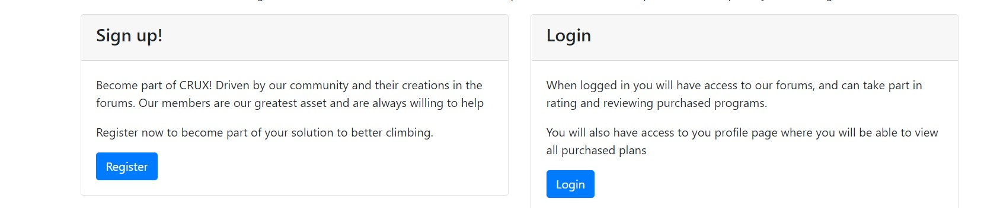


#### To be able to sign up as a registered user.
- Users can click either on the link in the top navbar, or in the CTA at the bottom of the index page 

- they are then taken to a form to sign up 
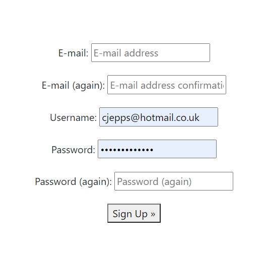
- the user is then redirected back to the homepage. A message will show to ask them to confirm their email
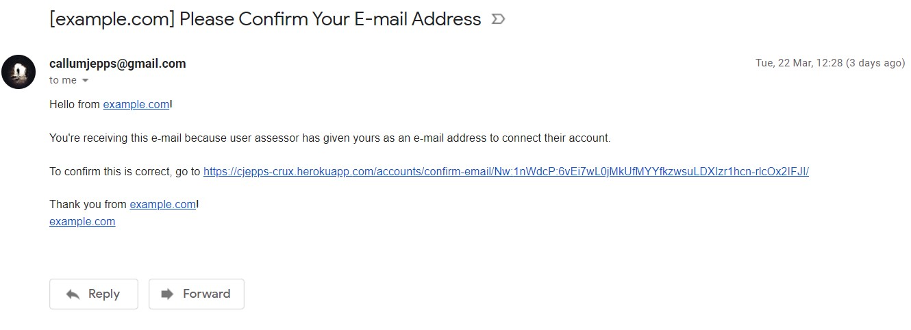
- The user's profile is now stored in the database
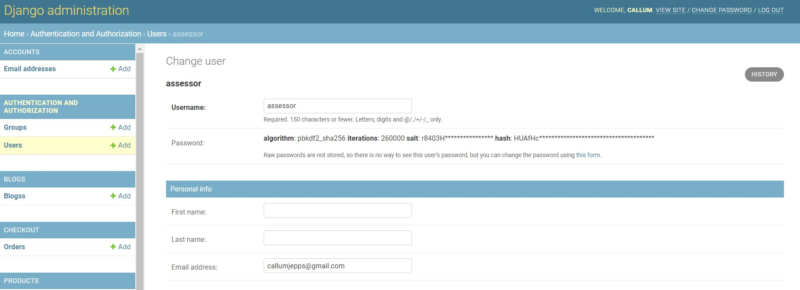


---

### As a registered user, I want:
---

####
#### To have access to blogs, where I can view admin submitted blog posts.
- Registered users can access the blogs through the nav bar or cards on the index page
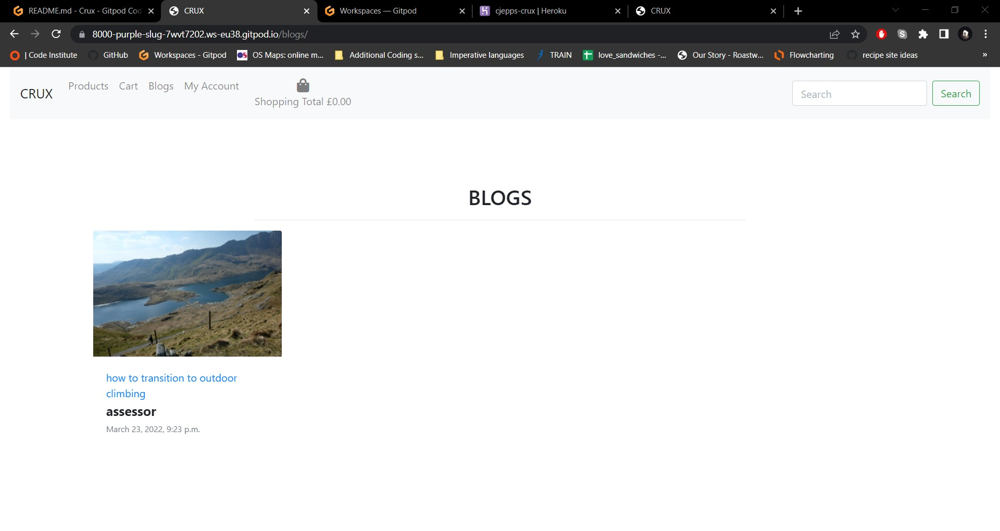
- Similarly to the products pages, a list of blogs will populate. The title, author, and blog picture will be displayed on a card
- When the product card is clicked on, the user is directed to the blog details template which shows more information contained in the blog 


#### To have access to my profile page so that I can view my purchased plans.
- Registered users can access their profile page through the navigation header

- The profile will then display their purchased plans which can be clicked on to provide more product details


#### To be able to log in/logout of my account using registered details.
- Registered users can login through a form provided by clicking on the login link in the main navbar
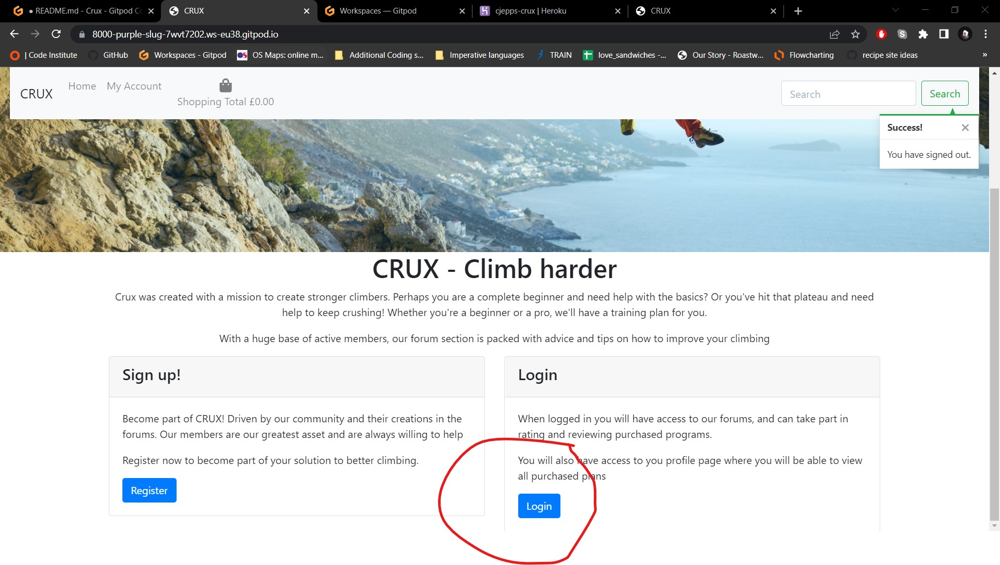

- Users can enter their username and password. on a successful login, the user is then redirected back to an updated homepage.
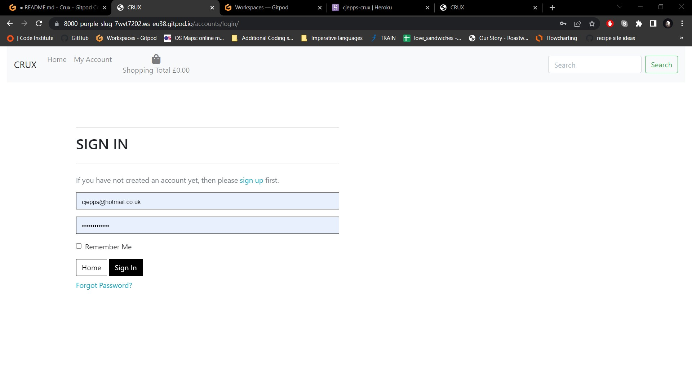

#### To view and edit my shopping cart when making purchases. 
- The shopping cart is displayed in the navbar and updates with the order total when products are added to the cart.
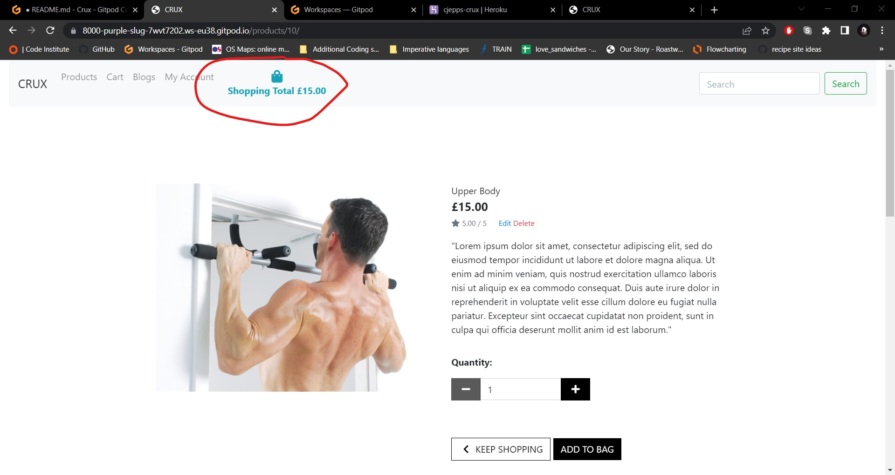
- When this is clicked, the user is taken to the shopping cart page where they can view the items in their order, update the quantity required and proceed to checkout.
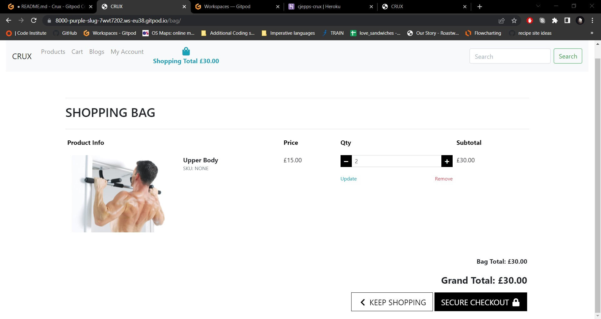

#### To be able to securely pay for products
- the checkout page features a form to fill out address details, an order summary, and a payment form provided by stripe
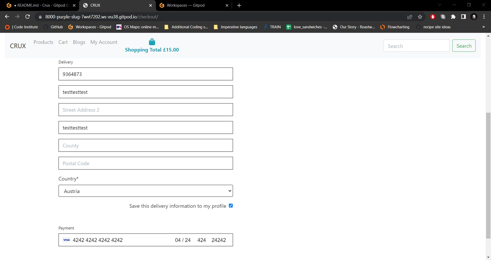
- On a successfull purchase, the user is redirected to an order confirmation page
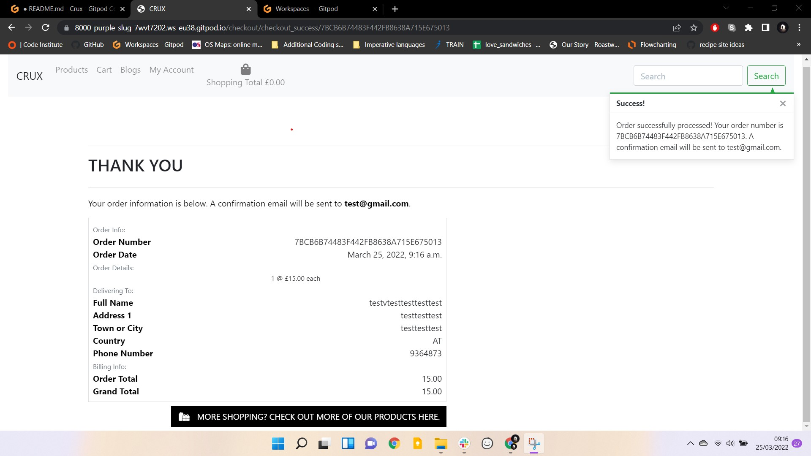


#### To be able to view reviews on products, helping to inform my purchase.
- registered users are able to submit and view reviews relating to each product on the product details page
- On successful submission of the addcomment form, the review will appear below the product for other users to see 
#### To be able to view climbing programs and memberships to purchase.
- Users are able to view climbing programs through the products section. They are displayed a gallery of cards containing important info about each plan. These are grouped by category, so users can search by category or keywords in the searchbar.
- When a product card is clicked, the user is directed to the product details page which contains further information relating to the product.   
---


### As a website owner, I want:
#### The ability to edit the content displayed on the website.
- this functionality is provided in the accounts dropdown in the main nav bar. Superusers are able to view a link to product management. Here, they are given a form in which to add a new product.
- Superusers are also given buttons on each product card where they can edit a product. A similar form to adding a product is given, prepopulated with data from the current product 
- Superusers are also given the option to delete products. They can do this by finding the product in all products and clicking the delete button. This removes the product from the database   


### Further Testing
---


## Deployment
---
(Created using tawnygoody's Tarmachan [readme](https://github.com/Tawnygoody/Tarmachan/blob/main/README.md)
## Local Deployment

Before deploying the project there are some requirements to be set up first.

First ensure the following are set up on your chosen IDE:
- [PIP3](https://pypi.org/project/pip/) Python package installer. 
- [Python 3.8.11](https://www.python.org/downloads/release/python-360/) or higher.
- [Git](https://git-scm.com/) version control.

Secondly you will need an account with Stripe in order to allow for online purchasing.

To set the project up locally you can follow the following steps: 

1. Navigate to the repository - [Crux Repo](https://github.com/CJepps/Crux)

2. Click the code dropdown button, ensure the HTTPS tab is selected in the dropdown and copy the url. 

3. In your IDE navigate to the desired directory. 

4. Open the terminal and enter the following code: 
    - ```
        git clone https://github.com/CJepps/Crux.git
        ```

Note: Alternatively you can select the "Download Zip" option from the dropdown menu, and extract the zip file to your chosen directory within your IDE. 

5. To install the required dependencies needed to run the application type the following into the terminal: 
    - ```
        pip3 install -r requirements.txt
        ```

6. Environment variables will then need to be set up. This can be done in a couple of ways: 
    1. Create an env.py file in the root directory, and ensure that it is added to the .gitignore file so that secret keys aren't published to GitHub. Add to the following code to the env.py file:
        - ```
            import os
            os.enviorn["DEVELOPMENT"] = True
            os.environ["SECRET_KEY"] = "Your Secret Key"
            os.environ["STRIPE_PUBLIC_KEY"] = "Your Stripe Public Key"
            os.environ["STRIPE_SECRET_KEY"] = "Your Stripe Secret Key"
            os.environ["STRIPE_WH_SECRET"] = "Your Stripe WH Secret Key"
            ```
    
    2. Set the environment variables with your IDE settings (if available):
        - |  Key  |  Value  |
          |-----| ----- |
          | DEVELOPMENT | True |
          | SECRET_KEY | Your Secret Key |
          | STRIPE_PUBLIC_KEY | Your Stripe Public Key |
          | STRIPE_SECRET_KEY | Your Stripe Secret Key |
          | STRIPE_WH_SECRET | Your Stripe WH Secret Key |

    - Your stripe variables can be located on your stripe dashboard. 
    - You can generate a secret key at [Django Secret Key Generator](https://miniwebtool.com/django-secret-key-generator/)

7. To set up the database you will need to migrate the database models. To do so type the following into the terminal: 
    - ```
        python3 manage.py makemigrations
        python3 manage.py migrate
        ```

9. Create a superuser to have access to the Django admin section by typing the following: 
    - ```
        python3 manage.py createsuperuser
        ```
    - Follow the commands in the terminal for the superuser details. 

10. You will then be able to run the app locally using the following command: 
    - ```
        python3 manage.py runserver
        ```


## Deployment to Heroku

1. Create a Heroku app: 
    - Navigate to [Heroku](https://www.heroku.com/) and log in or sign up. 
    - From the dashboard click on new app and give the app a name and choose the region closest to you. 
    - On the resources tab provision a new postgres database by typing in heroku postgres.
2. To use Postgres dj_database_url & psycopg2 need to be installed. 
    - In the terminal type the following commands:
        - ```
            pip3 install dj_database_url
            ```
        - ```
            pip3 install psycopg2-binary
            ```
3. Make sure Heroku installs all our apps requirements when we deploy it using the following command in the terminal:
    - ```
        pip3 freeze > requirements.txt
        ```
4. To set up the website's new database, navigate to settings.py import dj_database_url & comment out the default database configuration and replace the default database with a call to dj_database_url.parse. 
    - ```
        import dj_database_url
        DATABASES = {
            'default': dj_database_url.parse("your Postgres database URL in heroku")
        }
        ```
5. We need to run all migrations to the new Postgres database by entering the following in the terminal:
    - ```
        python3 manage.py migrate
        ```

7. A superuser was created with admin rights by typing the following into the terminal:
    - ```
        python3 manage.py createsuperuser
        ```
    - Follow the commands in the terminal for Username, email address and password
8. Add an if statement in settings.py for the default database, so that if the app is running on Heroku it connects to the Postgres database, otherwise the app connects to the SQLite3 database: 
    - ```
        if 'DATABASE_URL' in os.environ:
            DATABASES = {
                'default': dj_database_url.parse(os.environ.get('DATABASE_URL'))
            }
        else:
            DATABASES = {
                'default': {
                    'ENGINE': 'django.db.backends.sqlite3',
                    'NAME': BASE_DIR / 'db.sqlite3',
                }
            }
        ```
9. Gunicorn (Python WSGI HTTP Server for UNIX) will act as our webserver. To install it type the following into the terminal:
    - ```
        pip3 install gunicorn
        ```
    - Freeze that into the requirments file using: 
        - ```
            pip3 freeze > requirements.txt
            ```
10. Create a procfile in the root directory, to tell Heroku to create a web dyno, which will run gunicorn and serve the Django app. Type the following into the procfile: 
    - ```
        web: gunicorn crux.wsgi:application
        ```
11. After logging in to Heroku at the command line we need to temporarily disable collectstatic so Heroku won't try to collect static files when deployed: 
    - ```
        heroku login -i
        heroku config:set DISABLE_COLLECTSTATIC=1 --app "app name goes here"
        ```
12. In settings.py, add the hostname of our Heroku app, and allow localhost so gitpod will still work too: 
    - ```
        ALLOWED_HOSTS = ['"app name goes here".herokuapp.com', 'localhost']
        ```
13. To deploy to Heroku type the following into the command line: 
    - ```
        heroku git:remote -a "app name goes here"
        git push heroku master
        ```
14. To set up automatic deployments when we push the code to GitHub, in Heroku:
    - On the 'deploy' tab set the app to connect to GitHub by searching for the repository and clicking connect.
    - Click 'Enable Automatic Deploys" 
15. Using [Django Secret Key Generator](https://miniwebtool.com/django-secret-key-generator/) add the secret key to the config variables under the settings tab, which will act as the key for the Heroku app. 
    - We need to update the settings.py file so that the secret key is collected from the environment, and use an empty string as default: 
        - ```
            SECRET_KEY = os.environ.get('SECRET_KEY', '')
            ```
    - Additionally, set the debug to be true only if there's a variable called "DEVELOPMENT" in the environment. 
        - ```
            DEBUG = 'DEVELOPMENT' in os.environ
            ```

## Storing static files with AWS

### Creating a New Bucket

1. Navigate to [Amazon AWS](https://aws.amazon.com/) and log in or sign up. 
2. From the AWS Management Console search for S3 in the services' menu. 
3. Click the "create bucket" button and enter the following information:
    - Bucket Name: same name as the Heroku App. 
    - Region: enter the region that is closest to you.
    - Uncheck the "Block all public access" checkbox and acknowledge that the Bucket will be public.
    - Click the "Create bucket" button to create the bucket. 
4. Set some settings by clicking on the bucket that appears: 
    - Click the properties tab and turn on static website hosting, which gives a new endpoint to access the bucket from the internet. 
    - Click the properties tab to make 3 changes:
        1. Set the CORS configuration to: 
            - ```
                [
                    {
                        "AllowedHeaders": [
                            "Authorization"
                        ],
                        "AllowedMethods": [
                            "GET"
                        ],
                        "AllowedOrigins": [
                            "*"
                        ],
                        "ExposeHeaders": []
                    }
                ]
                ```
        2. Create a Security Policy for this Bucket using AWS S3 Bucket Policy generator located in the Bucket Policy tab:
            - Select the following options:
                - Policy Type: "S3 Bucket Policy"
                - Principal: Allow all principals using "*"
                - Actions: select "GetObject"
                - ARN: Copy the ARN from the permissions tab
            - Once the policy is generated copy the JSON document into the Bucket Policy editor. 
            - Before saving add a "/*" to the end of the resource key to allow access to all resources in this bucket.
            - Click the "Save" button. 
        3. Access the "Access Control List" tab, in the "Permissions" tab, and set the list objects permission for everyone under the "Public Access" section.

### Creating AWS Groups, Policies and Users

1. From the services menu search for IAM.
2. From the Access Management dropdown select 'User Groups'. 
    - Click the 'Create New Group" button:
        - Group name: Site relevant name. In this case "manage-crux"
        - Click next through to create group. 
3. From the Access Management dropdown select 'Policies'
    - Click the 'Create Policy' button: 
        - Go to the JSON tab and click 'import managed policy':
            - Search for S3 then select 'AmazonS3FullAccess' and click "import".
        - Get the ARN from the S3 bucket policy page and paste it in the "Resource" field as a list. Ensure two ARN's are added one for the bucket itself and another for all files and folders in the bucket (denoted by "/*" at the end of the string): 
            - ```
                {
                    "Version": "2012-10-17",
                    "Statement": [
                        {
                            "Effect": "Allow",
                            "Action": [
                                "s3:*",
                                "s3-object-lambda:*"
                            ],
                            "Resource": [
                                "arn:aws:s3:::crux",
                                "arn:aws:s3:::crux/*"
                            ]
                        }
                    ]
                }
                ```
        - Click the "Review Policy" button and give the policy a name and description and click the "create policy" button.
4. To attach the policy to the relevant group go back to the "User Groups" page:
    - Click the group you want to attach the policy to. 
    - Click "Attach Policy" 
    - Search for the policy that has been created and click the "Attach Policy" button.
5. From the Access Management dropdown click Users: 
    - Click the "Add User" button: 
        - Enter a user name and select the "Programmatic access' checkbox and select next: 
            - On the next page add the user to the group that was created and click through to create the user. 
        - Once the user is added download the CSV file which will contain the user's access key and secret access key, which will be used to authenticate the user from the Django App. 

### Connecting Django to S3

1. In order to connect the S3 bucket to Django two new packages are required: 
    - ```
        pip3 install boto3
        ```
    - ```
        pip3 install django_storages
        ```
    - Add the new dependencies to the requirements with the following: 
        - ```
            pip3 freeze > requirements.txt
            ```
    - Add Django-storages to the list of INSTALLED_APPS in the settings.py file: 
        - ```
            INSTALLED_APPS = [
                'django.contrib.admin',
                'django.contrib.auth',
                'django.contrib.contenttypes',
                'django.contrib.sessions',
                'django.contrib.messages',
                'django.contrib.staticfiles',
                'django.contrib.sites',
                'allauth',
                'allauth.account',
                'allauth.socialaccount',
                'home',
                'products',
                'bag',
                'checkout',
                'blogs',
                'profiles',
                
                

                # Other
                'crispy_forms',
                'storages',
            ]
            ```
2. To connect Django to S3 we need to update the settings.py file to tell Django which bucket it should be communicating with. We only want to this in the Heroku, so we can add an if statement to check if there's an environment variable called USE_AWS in the environment. 
    - ```
        if 'USE_AWS' in os.environ:
            AWS_STORAGE_BUCKET_NAME = 'cjepps-crux'
            AWS_S3_REGION_NAME = 'eu-west-1'
            AWS_ACCESS_KEY_ID = os.environ.get('AWS_ACCESS_KEY_ID')
            AWS_SECRET_ACCESS_KEY = os.environ.get('AWS_SECRET_ACCESS_KEY')
            AWS_S3_CUSTOM_DOMAIN = f'{AWS_STORAGE_BUCKET_NAME}.s3.amazonaws.com'
        ```
    - In Heroku we need to update the config variables: 
        - |  Key  |  Value  |
          |-----| ----- |
          | USE_AWS | True |
          | AWS_ACCESS_KEY_ID | Found in the CSV file when creating a user in IAM |
          | AWS_SECRET_ACCESS_KEY | Found in the CSV file when creating a user in IAM |
        - We need to remove the DISABLE_COLLECTSTATIC variable as django will now collect static files and upload them to S3. 
3. COLLECTSTATIC was renabled so that in production Django uses S3 to store static files and uploads new product and blog images to the bucket:
    - To do so create a new file in the root directory called 'custom_storages.py':
        - ```
            from django.conf import settings
            from storages.backends.s3boto3 import S3Boto3Storage


            class StaticStorage(S3Boto3Storage):
                location = settings.STATICFILES_LOCATION


            class MediaStorage(S3Boto3Storage):
                location = settings.MEDIAFILES_LOCATION
            ```
    - In settings.py these new storage classes were attached to new variables within the 'USE_AWS' block, so that in production static files are saved in a folder called 'static' and media files are saved in the folder called 'media'. URL's for media and static files have been overwritten using the custom domain and new locations:
        - ```
            if 'USE_AWS' in os.environ:
                # Bucket Config
                AWS_STORAGE_BUCKET_NAME = 'tarmachan'
                AWS_S3_REGION_NAME = 'eu-west-1'
                AWS_ACCESS_KEY_ID = os.environ.get('AWS_ACCESS_KEY_ID')
                AWS_SECRET_ACCESS_KEY = os.environ.get('AWS_SECRET_ACCESS_KEY')
                AWS_S3_CUSTOM_DOMAIN = f'{AWS_STORAGE_BUCKET_NAME}.s3.amazonaws.com'

                # Static and media files
                STATICFILES_STORAGE = 'custom_storages.StaticStorage'
                STATICFILES_LOCATION = 'static'
                DEFAULT_FILE_STORAGE = 'custom_storages.MediaStorage'
                MEDIAFILES_LOCATION = 'media'

                # Override static and media URL's in production
                STATIC_URL = f'https://{AWS_S3_CUSTOM_DOMAIN}/{STATICFILES_LOCATION}/'
                MEDIA_URL = f'https://{AWS_S3_CUSTOM_DOMAIN}/{MEDIAFILES_LOCATION}/'
            ```
    - To improve performance for our end users we can tell the browser that it's okay to cache static files for a long time since they don't change very often: 
        - Inside the 'USE_AWS' code block: 
            - ```
                # Cache Control
                AWS_S3_OBJECT_PARAMETERS = {
                    'Expires': 'Thu, 31 Dec 2099 20:00:00 GMT',
                    'CacheControl': 'max-age=94608000',
                }
                ```
4. In the S3 bucket create a new folder called 'media'. 
    - Inside the media folder click upload -> add files and select all the product, blog and site images:
        - Select 'Grant public read access to these objects' before clicking through to 'upload'. 

## Connecting Stripe to Heroku

1. Log in to [Stripe](https://stripe.com/gb) 
2. From the dashboard go to "developer" and select API Keys. Copy the publishable and secret keys and add them as config variables in Heroku:
    - |  Key  |  Value  |
      |-----| ----- |
      | STRIPE_PUBLIC_KEY | From Stripe |
      | STRIPE_SECRET_KEY | From Stripe |
3. Add a new webhook endpoint by clicking webhooks in the developers menu on stripe and clicking the "add endpoint" button: 
    - Add the endpoint as the URL for the heroku app followed by "checkout/wh/", and set up to receive all events: 
        - ```
            https://crux.herokuapp.com/checkout/wh/
            ```
4. Copy the signing secret for the new webhook and add it to the heroku config variables: 
    - |  Key  |  Value  |
      |-----| ----- |
      | STRIPE_WH_SECRET | From Stripe |


## Credits
---
### Larger dependencies included:

- The code institute tutorial for the Boutique Ado project
- TawnyGoody's Tarmachan project for inspiration and layout of blogs pages [here](https://github.com/Tawnygoody/Tarmachan)
 